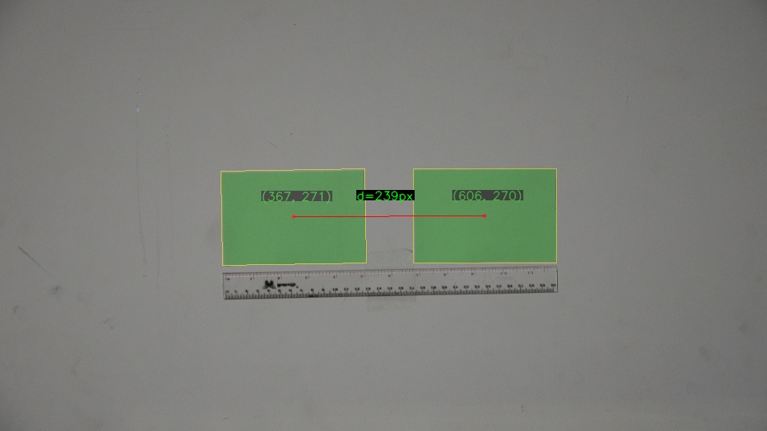
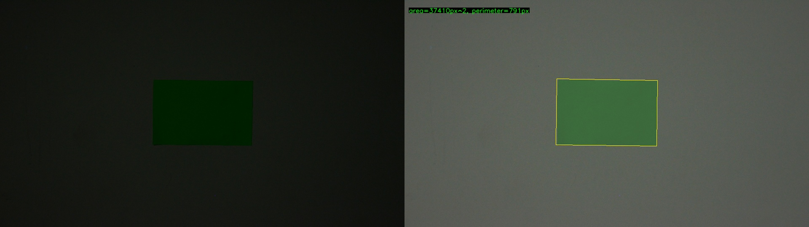

# Assignment 2

## Table of Contents

- [About](#about)
- [Result at a Glance](#result)

## About 

There are two task on this assignment. I solve them with two different program:
- [`10219084_no01.py`](./10219084_no01.py)
- [`10219084_no02.py`](./10219084_no02.py)

The result overview can be seen here: [`10219084_Tugas02.ipynb`](./10219084_Tugas02.ipynb)

Besides, the goals of these two task are:

1. **Measure displacement of object**

    I will have 2 images that will be taken by static camera. The position of single object will be different between these 2 images.

    The 1st level architecture, **`main()`** algorithms:
    - Process `image1` and find the centroid of the object. Do the same thing to `image2`.
    - Blend this 2 image, so I get `im_final`.
    - Save all images

    The 2nd level architecture, `**im_process()**` algorithms:
    - Read original image
    - Resize it to (960x540) px
    - Convert BGR to HSV color space
    - Gaussian blurring to reduce noise
    - Determine the HSV color boundary by analyzing the HSV histogram
    - Extract specific color. I will have `mask`, it's a binary image
    - Do morphological transformation to remove any small area. I use opening: erosion followed by dilation.
    - Canny edge detection
    - Find the contours, convert it into `boxes` format, then draw it
    - Get the centroid from every boxes, also draw the centroid
    - Return `im_processed` and `centroid_arr`

    The 2nd level architecture, `**get_final_im()**` algorithms:
    - Blend 2 processed image
    - Draw line between 2 centroid points
    - Calculate euclidian distance
    - Get the midpoint between them, then put text near this point
    - Return `im_final`

2. **Remove Salt & Pepper Noise**

    I captured an image wheen it night, so I hope that my camera will produce noise by itself. Then, I need to measure area and perimeter of it, but I have to remove the noise first. I vary the size of kernel (3 sizes) and the type of filter (2 types).

    Cause I will resize the image into (960x540) px, I choose the kernel size to be:
    - (5x5) px
    - (51x51) px
    - (111x111) px
    and based on the reference book: [Fundamentals of Digital Image Processing](https://www.fundipbook.com/materials/) in section 4.4, I prefer using:
    - Median Filter
    - Gaussian Filter

    The 1st level architecture, **`main()`** algorithms:
    - Define `im_path`, `arr_ksize`, `arr_filter`
    - Define `arr_im`, `arr_labels`
    - Iterate for every type of filter
    - Iterate for every ksize
    - Get the processed image, append it and it's label to suitable array
    - In the of looping, save all image

    The 2st level architecture, **`im_process()`** algorithms:
    - Read original image
    - Resize it to (960x540) px
    - *(Optional) Add salt & pepper manually if the original image don't have it
    - *Adjust brightness and contrast
    - Convert BGR to HSV
    - *Remove noise using median/gaussian filtering
    - Determine the HSV color boundary by analyzing the HSV histogram
    - Extract specific color. I will have `mask`, it's a binary image
    - Do morphological transformation to remove any small area. I use opening: erosion followed by dilation.
    - Canny edge detection
    - Find the contours, convert it into `boxes` format, then draw it
    - *Find the area and perimeter of largest contour
    - *Put information text about area and perimeter
    - *Horizontal concatenate to compare `im_ori` and `im_final`.

    

## Result at a Glance 

1. **Measure displacement of object**

    `im_final.jpg`\
    </img>

2. **Remove Salt & Pepper Noise**

    `gaussian_51x51.jpg`
    </img>

